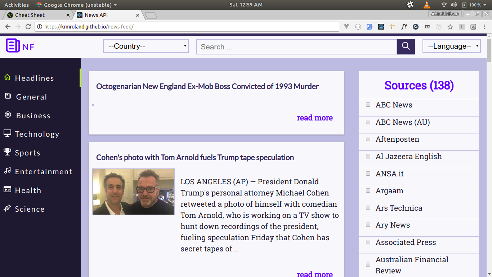

# [News Feed App ](https://krmroland.github.io/news-feed/)

A simple news feed app made with [React](https://reactjs.org/) that consumes [News Api](https://newsapi.org/) that I intend to make 100% _PWA_

## Demo

[https://krmroland.github.io/news-feed/](https://krmroland.github.io/news-feed/)

## Prerequisites

* [Node js](https://nodejs.org/en/) installed on your machine
* A package manager [npm](https://www.npmjs.com/) or [yarn](https://yarnpkg.com/lang/en/)
* [Git](https://git-scm.com/) Version Control System

## Installation

* Clone the repo locally to your machine `git clone https://github.com/krmroland/news-feed.git`

* Install package dependencies `yarn` or `npm install` depending on which package manager you are using

* Run `npm run start` or `yarn start` to compile and boot up a development server

* Run `npm run build` or `yarn build` to minimize and compile the code for production
